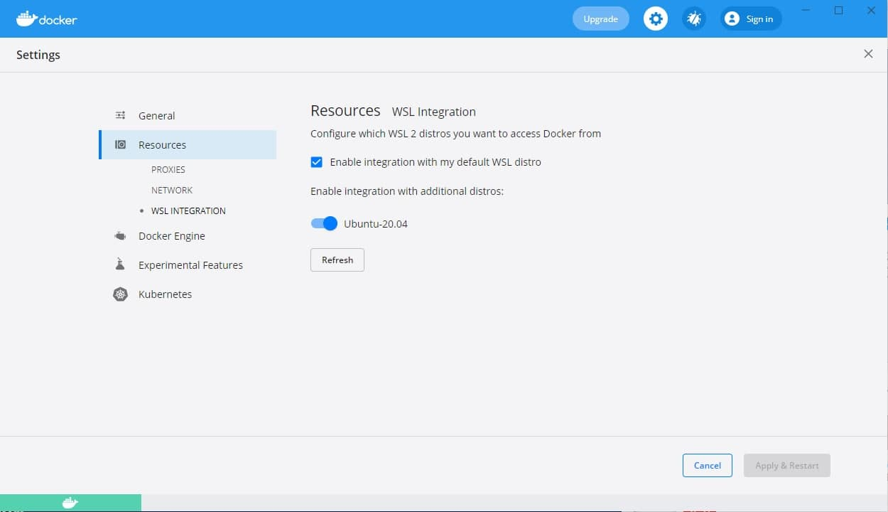

# Тестовое задание на основе Docker и Laravel для Frontend разработчика

## Первоначальная настройка

-   Устанавливаем Docker c [официального сайта](https://www.docker.com/products/docker-desktop) и [Docker Compose](https://docs.docker.com/compose/install/);
-   Для пользователей Windows дополнительно необходимо установить виртуальное ядро Linux:
    -   Скачиваем с официального сайта необходимый [пакет](https://wslstorestorage.blob.core.windows.net/wslblob/wsl_update_x64.msi);
    -   Устанавливаем пакет;
    -   Запускаем Powershell и выполняем команду `wsl --set-default-version 2`;
    -   Устанавливаем из Microsoft Store [Ubuntu](https://www.microsoft.com/store/apps/9n6svws3rx71);
    -   Запускаем настройку Ubuntu из пуска, задаем имя пользователя и пароль;
    -   Настраиваем Docker:
        -   Запускаем Docker Desktop и переходим в настройки ;
        -   Во вкладке General включаем 'Use the WSL 2 based engine';
        -   Сохраняем настройки;
        -   Переходим во вкладку Resources ;
        -   Выбираем раздел WSL Integration;
        -   Включаем свеже установленный образ Ubuntu;
        -   Сохраняем настройки;
-   Собираем контейнер командой в папке проекта `docker-compose up -d`;
-   Инициализируем сервер:
    -   при запущенном контейнере в папке проекта запускаем команду `docker-compose exec app bash`;
    -   запускаем сборку `sed -i 's/\r$//' init.sh`, затем `bash ./init.sh`.

## Сборка демо проекта

-   при запущенном контейнере в папке проекта запускаем команду `docker-compose exec app bash`;
-   собираем js `yarn dev`.

## Описание API

| Описание                        | Тип запроса |             Структура |                      Параметры |
| ------------------------------- | :---------: | --------------------: | -----------------------------: |
| Получить все комментарии        |     GET     |      `/api/comments/` |                                |
| Получить конкретный комментарий |     GET     | `/api/comments/${id}` | id - идентификатор комментария |
| Создать комментарий             |    POST     | `/api/comments/`      |                                |
| Удалить комментарий             |   DELETE    | `/api/comments/${id}` | id - идентификатор комментария |
| Обновить комментарий            |    PATCH    | `/api/comments/${id}` | id - идентификатор комментария |

## Описание записи

`{ name: 'Имя создателя', text: 'Текст комментария', date: 'Дата создания комментария в строковом формате(выбирается создателем)', }`

## Задание

Создать сайт со списком комментариев. Форма добавления комментария должна располагаться под уже добавленными комментариями.

Требования к разработке:

-   добавление и удаление комментариев (без перезагрузки страницы);
-   постраничный просмотр комментариев (3 комментария на страницу c возможностью выбора конкретной);
-   сортировка по:
    - id;
    - дате добавления;
-   направления сортировки:
    - по возрастанию;
    - по убыванию;
-   реализация сортировки и пагинации на vue;
-   использование при реализации готового пакета для vue2 (datepicker) – он будет автоматически установлен при настройке проекта, для реализации работы можно использовать axios;
-   хранение комментариев в vuex (установить самостоятельно);
-   учет результатов операций изменения и удаления комментариев при пагинации и сортировке;
-   использование адаптивной верстки;
-   использование js-фреймворка vue2;
-   загрузка комментариев по ajax;
-   использование vuex;
-   реализация возможности изменять сортировку для пользователя;
-   использование при создании комментария:
    -   поля ввода для имени пользователя;
    -   текста комментария;
    -   выбора даты (через datepicker);
-   запрещено использовать библиотеки готовых компонентов например vuetify и т.п.

## Код размещается в папке:

`resources/js/`
